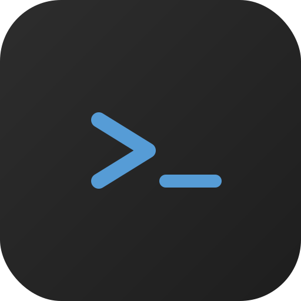
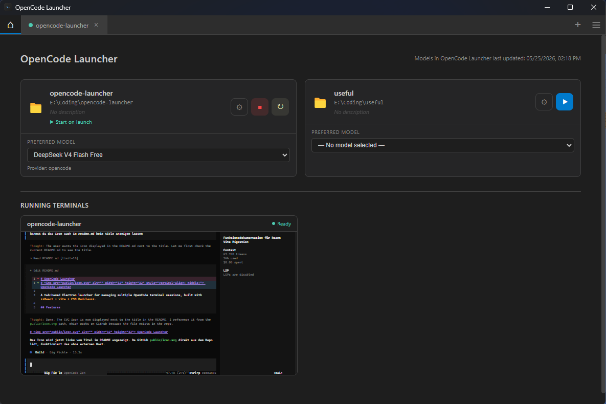

#  OpenCode Launcher

A tab-based Electron launcher for managing multiple OpenCode terminal sessions, built with **React + Vite + CSS Modules**.



## Features

### Dashboard
- **Directory Cards** – Saved directories displayed as cards with name, path, optional description, auto-launch badge, and per-directory model selector
- **Drag & Drop Reordering** – Rearrange cards on the dashboard by dragging
- **Inline Card Editor** – Edit name, description, auto-launch, and session continuation settings per card without leaving the dashboard
- **Model Selector** – Choose a preferred AI model per directory, grouped by provider (OpenCode, GitHub Copilot, LiteLLM)
- **Live Status Buttons** – Play, Stop, and Restart buttons that sync with running terminal state
- **Preview Terminals** – Read-only mini xterm.js previews (font size 6) of all running terminals shown below the cards; fixed 280px height with FitAddon; click any preview to activate the full terminal
- **Split Preview** – When a terminal has a split, the preview shows both terminals sharing the fixed height according to the split ratio
- **Drag & Drop Folders** – Drop folders from your file explorer directly onto the dashboard to add them
- **Add Directory Dialog** – Browse and add project directories with three save modes: save & open, save only, or open only

### Terminal Management
- **Multi-Tab Interface** – Open multiple terminal sessions in tabs with PTY-backed shell sessions
- **Split Terminal** – Right-click a tab to open a separate terminal pane side-by-side via a draggable divider; close via context menu or the split's close button
- **Tab Drag & Drop** – Reorder tabs by dragging; tab order is persisted across restarts
- **Tab Context Menu** – Right-click tabs to restart, open/close separate terminal, or close
- **Keyboard Shortcuts**
  - `Ctrl+T` – New terminal
  - `Ctrl+W` – Close current tab
  - `Ctrl+Tab` / `Ctrl+Shift+Tab` – Cycle through tabs (includes Home tab)
  - `Ctrl+S` – Save editor tab (config file)
  - `Escape` – Close dialogs, context menus
- **Copy & Paste** – `Ctrl+C` copies terminal selection to clipboard; `Ctrl+V` pastes clipboard content into the terminal
- **Auto-Resize** – Terminal and PTY automatically resize on window resize, tab switch, or split close
- **Processing Detection** – Terminal indicator shows processing state (green = idle, yellow = processing > 100 bytes output, red = error, gray = stopped). Suppressed during tab switch (500ms), mouse movement/scroll (200ms) to prevent resize redraws or app responses from falsely triggering the indicator. Mouse tracking data is filtered at source level.
- **Display Name Deduplication** – Multiple terminals in the same directory are suffixed with `(1)`, `(2)`, etc.
- **Error Handling** – PTY errors are shown inline in the terminal output

### OpenCode Config Editor
- **Integrated Editor** – Edit `opencode.json` directly in a tab using CodeMirror with JSON syntax highlighting, line numbers, bracket matching, and active line highlighting
- **Dirty Tracking** – Unsaved changes shown with an asterisk (`*`) in the tab label
- **JSON Validation** – Validates JSON before saving to prevent corrupt config files
- **Save Shortcut** – `Ctrl+S` to save; also accessible via tab context menu

### Developer Tools
- **Custom DevTool Window** – Separate Electron window with LogViewer: filterable, searchable log output from the BroadcastChannel-based logger
- **Log Context Menu** – Right-click a log entry to copy its full formatted message
- **Chrome DevTools** – Button to open the main window's Chrome DevTools in detached mode

### Settings
- **Default Startup Tab** – Choose between Home (dashboard) or any saved directory as the startup tab
- **Language Selection** – Switch between German and English (flag icons); requires restart to take full effect

### Actions Menu
- **Reload Models** – Refresh the available model list on demand
- **Edit OpenCode Config** – Open the integrated config editor tab
- **Restart Launcher** – Restart the application (with automatic rebuild check)
- **Settings** – Open the settings dialog

### Model Management
- **Per-Directory Model Selection** – Assign a preferred AI model to each directory independently
- **Provider Grouping** – Models grouped by provider (OpenCode, GitHub Copilot, LiteLLM)
- **Model Caching** – Models cached with a timestamp in `config.json` to avoid slow CLI reloads on every startup
- **Manual Refresh** – Force-refresh models via the Actions menu or reload button

### Startup & Configuration
- **Auto-Launch** – Mark directories to automatically start a terminal on launcher open
- **Default Startup Tab** – Configure which tab (Home or a specific directory) opens on startup
- **Session Continuation** – Option to pass `--continue` to OpenCode to resume previous sessions
- **Tab Order Persistence** – Tab order is saved to `config.json` and restored on next launch
- **Directory Validation** – On startup, checks which saved directories still exist and removes missing ones automatically
- **Double-Open Prevention** – In-flight terminal creation per directory is tracked to prevent accidental duplicate tabs
- **Persistent Config** – All settings saved to `config.json` with merge semantics (preserves unknown fields)

### Build System
- **Smart Build Check** – Timestamp-based Vite build check before launch (compares `dist/index.html` mtime against source files); skips rebuild when up-to-date
- **Auto-Rebuild on Restart** – Restarting the launcher checks if a rebuild is needed and shows a spinner overlay during the build process
- **Cross-Platform Start Scripts** – `start.bat` (Windows) and `start.sh` (Linux/macOS) both run the build check before launching

### Multi-Language
- **German & English** – Full UI translations for both languages
- **Flag Icons** – Country flags displayed in the language selector
- **Instant Switch** – Language change takes effect after restart

### Technical
- **React 18 + Vite** – Modern frontend toolchain with HMR during development
- **CSS Modules** – Component-scoped styling with global variables for theming
- **Logger Service** – BroadcastChannel-based logger with 2000-entry ring buffer, subscribable from both main window and DevTool window; auto-saves last 500 entries to `logs/` on error (max once per 30s) with IPC timing instrumentation (>10ms logged as debug)
- **PTY-Based Terminals** – Uses `node-pty` for real shell sessions with xterm.js rendering
- **Graceful Shutdown** – All PTY processes are killed on window close
- **xterm.js v6** – Modern terminal rendering with fit addon, custom key handlers, and scroll suppression
- **Dark Theme** – VS Code-inspired dark theme (`#1e1e1e` background)
- **Auto-Hide Menu Bar** – Clean, distraction-free UI with application menu disabled
- **Electron Context Isolation** – Secure IPC via preload bridge with `contextIsolation: true`
- **Error Boundary** – React error boundary catches render errors without crashing the full app
- **Log Persistence** – Errors auto-save a crash log to `logs/` in the project root (gitignored)
- **Config Merge** – Saves config with merge semantics (`{...existing, ...updates}`) to preserve unknown fields
- **142 Tests** – Vitest with React Testing Library and jsdom environment

## Requirements

- Node.js 18+
- OpenCode CLI (`opencode` must be in PATH)
- Build tools for `node-pty` native compilation

## Installation

```bash
npm install
```

### Linux / macOS

```bash
npm run rebuild   # Rebuild node-pty for your platform
```

## Usage

### Windows
```bash
start.bat
# or
npm start
```

### Linux / macOS
```bash
./start.sh
# or
npm start
```

### Development
```bash
npm run dev       # Start Vite dev server
```

## Configuration

Settings are stored in `config.json` in the project root:

```json
{
  "directories": [
    {
      "name": "my-project",
      "path": "/path/to/project",
      "description": "My project description",
      "model": "anthropic/claude-sonnet-4-20250514",
      "startOnLaunch": false,
      "continueSession": false
    }
  ],
  "defaultTab": "home",
  "tabOrder": [],
  "modelsCache": {
    "timestamp": "2025-01-01T00:00:00.000Z",
    "models": []
  }
}
```
